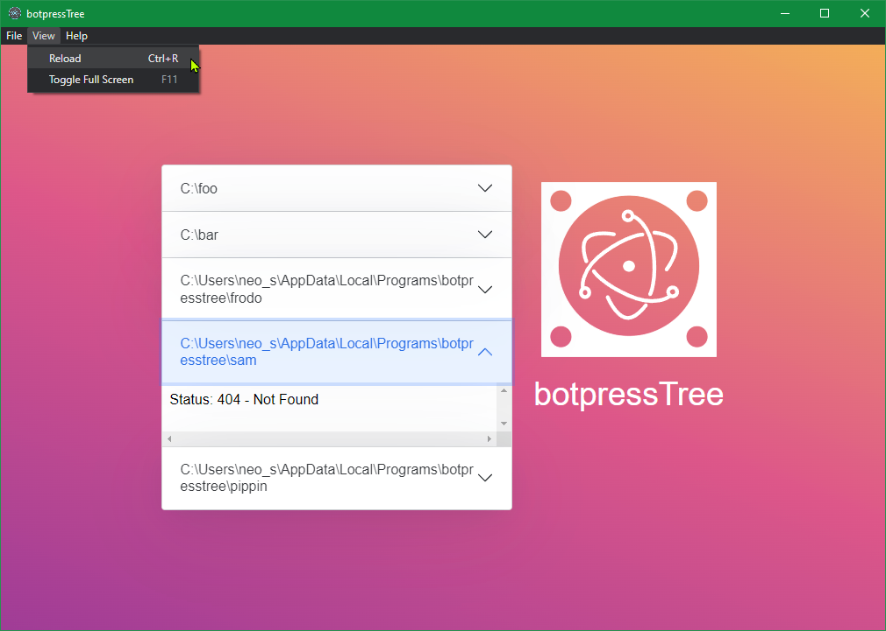

## Starting Development

Start the app in the `dev` environment:

```bash
yarn start
```

## Packaging for Production

To package apps for the local platform:

```bash
yarn run package
```

## Boilerplate Docs

See `electron-react-boilerplate` [docs and guides here](https://electron-react-boilerplate.js.org/docs/installation)

## Screenshots

Hello, botpressTree!


Foo Directory.


Frodo Directory. Text wrapping. Many files. Long filenames. Scrollbars.


Status: 404 - Not Found


View: Reload



## Explanations -- Key Architectural Choices

👉 **vs-code like file explorer**

Okay. So this sounds like the left-most "pane" that many developers will be familiar with.

Especially important to note:

- multiple collapsible sections
- multiple paths to local directories
- tree-view is mandated
- should be rendered in a browser
- should be launched via command line prompt
- should be a 4-5 hour solution? or was that supposed to be days?

Some assumptions taken for granted to simply the problem-space:

- the ONLY interactions of concern are are modifications at the filesystem level;
  put another way, for the sake of simplicity, this file-explorer will not need to
  feature manipulations -- it may be read-only; this saves me from having to write
  tons of hooks/handlers and reduces the scope of the time investment needed

The focus here shall primarily be:

- there exists a read-only file explorer
- there exists a browser
- there exists command line parameter handling
- there exists just barely enough "glue" code to punch through some
  basic security barriers inherent between host and browser environments
- there exists just barely enough "structure" to position the file explorer
  component very roughly into place; leaving detailed design considerations
  for other folks to worry about

👉 **key components of proposed solution**

To fulfil the "in a browser" requirement simultaneously with "is an application",
I've opted to start with `electron-react-boilerplate`. I assume that it is clear
to the reader how "electron" technically provides a Chromium-based web browser.

To fulfill the "multiple collapsible sections" requirement, I employed
`react-bootstrap` [npm page](https://www.npmjs.com/package/react-bootstrap).
Specifically, I used its `Accordion` component
[doc/guide here](https://getbootstrap.com/docs/5.0/components/accordion/).

To fulfill the "file explorer" tree-view, I selected `react-folder-tree`
[npm page](https://www.npmjs.com/package/react-folder-tree).

To supply `react-folder-tree` with an appropriate data-structure, I employed `directory-tree`
[npm page](https://www.npmjs.com/package/directory-tree).

To watch the file system for changes, I opted for `chokidar`
[npm page](https://www.npmjs.com/package/chokidar).

To bridge the security-context gap, Electon's
[IPC system](https://www.electronjs.org/docs/latest/tutorial/ipc) was used.
`get-paths` and `get-tree` IPC functions/messages do the work. `chokidar` events
continuously refresh state, reactively, on the `get-tree` communication channel.

👉 **edge cases**

There are two particularly special situations:

- a given directory does not yet exist
- a given directory stops existing

In those two cases, the application will render "Status: 404 - Not Found"
instead of a tree-view. When the given directory exists once again, then,
it will be detected and its contents refreshed/rendered as a tree-view anew.

Another special case is:

- Rapidly deleted/re-created directories/files

These present challenges to the file system watcher (chokidar) if operations
are done in very rapid succession. In order to provide one layer of fallback,
an extra `setTimeout` re-evaluation of the contents of each given directory
is used, with a delay of 2.5 seconds, which should be sufficient time on
modern SSD-based compute platforms for the vast majority of such second-chance
updates to smooth-over small bursts that cannot be caught by the file system
watcher systems the first time around. Very rarely, or, under extreme situations,
there is a risk of "oh, the watcher and second-chance updater failed to refresh".
Sometimes, it may be possible that: letting things "settle down" (ie: stop all
the intense file system operations) and then doing one more small change to
a directory of interest -- is enough to trigger a proper refresh.

A "refresh" button may also be warranted to help with addressing such rare
circumstances.

The "View -> Reload" (menu) function might also be useful in such cases.

👉 **UX design considerations**

As stated previously, only very rough "design" choices were supplied for this
solution. An extremely constrained "300px" height limit is used to keep things
from getting too tall and out of hand. It is expected that only a handful
of directories will be watched. No provisions were made for watching several
dozen directories -- they would simply overflow, onrestricted in their vertical
growth. This is a limitation of "separation of concerns", carving away UX
worries in order to focus on functional aspects at the core the challenge.

It is presumed that more work will be done in the future to further refine the
"component" when it has more mature UX context of operation and only then shall
I be more interested in fine-tuned handling of width / height / overflow concerns.

For now, the file explorer component merely "floats" roughly to the left of the
placeholder "logo + title" section.

👉 **more details in code comments, sparsely**

In a few places within the "newly written code" that I've produced (you can inspect
`git diff` to figure that out, I trust), there are a few handy comments around
some of the more complex blocks of code; the parts that would become mysterious
to me over time when I revisit things in a few months from now.

However, do note that I've not fully elaborated data flows coupled with events
in any particular place that is "easy" to interpret. I leave that as an exercise
for the next maintainer. The point here is that such high level documentation
would be made in a more formal setting. Here, as a "getting a job" pitch, I shall
refrain from doing so.

👉 **apologies, in advance, to the purists**

There are some aspects of the code that I would qualify as "awkward". Sorry.
I'd love to discuss/debate those points in order to imporve on them. For instance:
`import` vs `require`. For now, things are working as-is so I won't go around
trying to "fix it" following the "if it ain't broken, don't fix it" principle.
Worth reworking for standardization purposes, but not for functional purposes.

👉 **system requirements**

This solution has been developed on Windows 10. In theory, it should work just
fine on Linux and on MacOS systems, too.

Software packages employed:

- nodeJS v16.10.0
- npm v7.24.0
- yarn v1.22.11

Please try to match those for compatibility purposes. I'd offer you a containerized
development, testing, and build solution, but that's very much outside the scope
of the immediate problem statement.

This solution is meant to be driven using `yarn` instead of `npm`, by the way.

## Explanations -- dev mode

Start the app in the `dev` environment, and slightly cheat in the method to provision the PATHS parameters.

This is an example from within "git-bash" on Windows:

```bash
PATHS=/c/foo:/c/bar:/c/bob\ alice:/c/baz yarn start
```

You can set it up so that 3 folders exist initially:

- C:/foo/
- C:/bar/
- C:/bob alice/

If a folder does not exist (C:/baz/), it is fine; once it does exist, it will be rendered as a FolderTree.

A simple cycle of wiping out and recreating folders and files looks like this:

```
rm -rf /c/baz
mkdir -p /c/baz/baz/baz
```

It's challenging to do `argv` parameters within a development context, and thus, `PATHS` is employed
as a close-enough proxy for them.

**NOTICE**: the `:` (colon) character is used to separate paths; but, it may not work outside of Windows
due to the special way paths are "handled" with automatic subsitutions on that platform. On Windows,
the `:` (colon) are transformed to `;` (semi-colon) and that's the ultimate "split" character when
the program evalutes how to interpret multiple paths from the `PATHS` environment variable.

## Explanations -- production mode

If you "package" the application (see above) and install it on your computer, then you can operate the application
in full production mode. You'll need to fulfill all the system requirements of being able to develop/build on your host
system, too -- often extra burdensome on MacOS, for instance (e.g. XCode et al).

The main point is that this mode is capable of handling `argv` parameters as
required by the problem statement. I trust that the reader is sufficiently well-versed in handling
their own operating system and would not need extremely detailed step-by-step instructions on how to go
about executing an application via command-line.

The installer file(s) are created under the directory `release/build`.

This is an example execution from within "git-bash" on Windows, after running the installer.
`<INSTALL_DIR>` represents the absolute path of wherever `botpressTree.exe` (or equivalent,
depending on operating system) has been installed on your system.

```bash
cd <INSTALL_DIR>
PATHS=/c/foo:/c/bar ./botpressTree.exe frodo sam pippin
```

The result is that all of these 5 paths will be evaluated and tracked:

- C:/foo/
- C:/bar/
- <INSTALL_DIR>/frodo
- <INSTALL_DIR>/sam
- <INSTALL_DIR>/pippin

Relative paths are resolved into absolute paths. Example: "frodo" becomes
"C:/botpressTree/frodo" if the <INSTALL_DIR> happens to be "C:/botpressTree".
